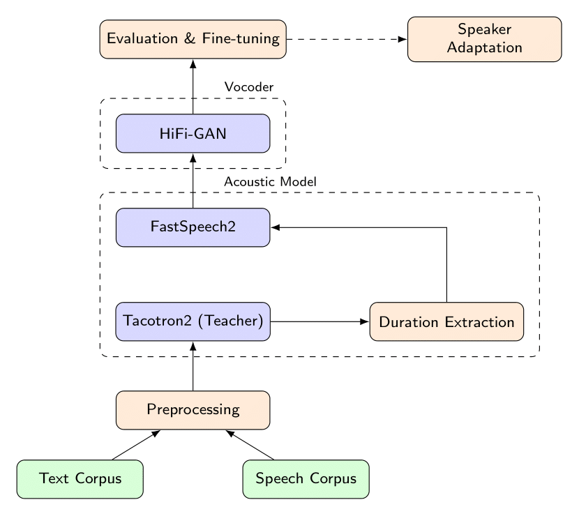

# STOMA: A Multi-Speaker Greek Speech Corpus

STOMA is a new multi-speaker Greek speech corpus designed to advance research in text-to-speech (TTS) synthesis and related speech technologies for under-resourced languages. The corpus comprises approximately 23 hours of professionally recorded read speech from six native speakers (three male and three female), captured under controlled studio conditions using a dual-booth setup to ensure acoustic consistency and high signal quality. The spoken material was selected from the Text Bank of the Center for the Greek Language, specifically from texts corresponding to the B2, C1, and C2 proficiency levels of the Certification of Attainment in Greek, ensuring linguistically rich and pedagogically balanced content. All recordings were standardized to 44.1 kHz, 16-bit mono PCM format and processed through a hybrid quality control pipeline combining automated normalization and manual verification. To assess dataset quality, we trained state-of-the-art neural TTS systems based on the FastSpeech2 acoustic model and the HiFi-GAN vocoder, achieving natural and intelligible synthesized speech. The resulting corpus provides a publicly accessible, high-quality resource that supports both linguistic research and the development of modern speech synthesis systems in Greek.

## Dataset
The dataset is available at the following location: [STOMA](https://huggingface.co/datasets/aangelakis/STOMA)

<div align="center">

  <strong>Table 1: Text statistics for the full text collection (Greek Harvard, B2, C1, and C2), recorded in its entirety by the two primary speakers.</strong>

  <table>
    <thead>
      <tr>
        <th>Statistic</th>
        <th>Gr. Harvard</th>
        <th>B2</th>
        <th>C1</th>
        <th>C2</th>
        <th>Total</th>
      </tr>
    </thead>
    <tbody>
      <tr>
        <td>Total Sentences</td>
        <td align="center">720</td>
        <td align="center">1,087</td>
        <td align="center">1,571</td>
        <td align="center">1,296</td>
        <td align="center">4,674</td>
      </tr>
      <tr>
        <td>Total Words</td>
        <td align="center">5,539</td>
        <td align="center">15,102</td>
        <td align="center">25,263</td>
        <td align="center">22,722</td>
        <td align="center">68,626</td>
      </tr>
      <tr>
        <td>Total Characters</td>
        <td align="center">32,301</td>
        <td align="center">95,119</td>
        <td align="center">164,700</td>
        <td align="center">152,904</td>
        <td align="center">445,024</td>
      </tr>
      <tr>
        <td>Distinct Words</td>
        <td align="center">3,343</td>
        <td align="center">5,606</td>
        <td align="center">8,965</td>
        <td align="center">8,275</td>
        <td align="center">20,253</td>
      </tr>
      <tr>
        <td>Mean Words per Sentence</td>
        <td align="center">7.69</td>
        <td align="center">13.89</td>
        <td align="center">16.08</td>
        <td align="center">17.53</td>
        <td align="center">14.68</td>
      </tr>
      <tr>
        <td>Min Words per Sentence</td>
        <td align="center">5</td>
        <td align="center">1</td>
        <td align="center">1</td>
        <td align="center">1</td>
        <td align="center">1</td>
      </tr>
      <tr>
        <td>Max Words per Sentence</td>
        <td align="center">9</td>
        <td align="center">32</td>
        <td align="center">41</td>
        <td align="center">39</td>
        <td align="center">41</td>
      </tr>
    </tbody>
  </table>

</div>

<div align="center">

  <strong>Table 2: Text statistics for the reduced text subset selected from the full collection, used for recordings by the secondary speakers.</strong>

  <table>
    <thead>
      <tr>
        <th>Statistic</th>
        <th>Gr. Harvard</th>
        <th>B2</th>
        <th>C1</th>
        <th>C2</th>
        <th>Subset Total</th>
      </tr>
    </thead>
    <tbody>
      <tr>
        <td>Total Sentences</td>
        <td align="center">720</td>
        <td align="center">190</td>
        <td align="center">194</td>
        <td align="center">197</td>
        <td align="center">1,301</td>
      </tr>
      <tr>
        <td>Total Words</td>
        <td align="center">5,539</td>
        <td align="center">2,913</td>
        <td align="center">3,057</td>
        <td align="center">3,265</td>
        <td align="center">14,774</td>
      </tr>
      <tr>
        <td>Total Characters</td>
        <td align="center">32,301</td>
        <td align="center">18,286</td>
        <td align="center">20,190</td>
        <td align="center">22,110</td>
        <td align="center">92,887</td>
      </tr>
      <tr>
        <td>Distinct Words</td>
        <td align="center">3,343</td>
        <td align="center">1,519</td>
        <td align="center">1,604</td>
        <td align="center">1,676</td>
        <td align="center">6,899</td>
      </tr>
      <tr>
        <td>Mean Words per Sentence</td>
        <td align="center">7.69</td>
        <td align="center">15.33</td>
        <td align="center">15.76</td>
        <td align="center">16.57</td>
        <td align="center">11.36</td>
      </tr>
      <tr>
        <td>Min Words per Sentence</td>
        <td align="center">5</td>
        <td align="center">4</td>
        <td align="center">3</td>
        <td align="center">4</td>
        <td align="center">3</td>
      </tr>
      <tr>
        <td>Max Words per Sentence</td>
        <td align="center">9</td>
        <td align="center">28</td>
        <td align="center">28</td>
        <td align="center">30</td>
        <td align="center">30</td>
      </tr>
    </tbody>
  </table>

</div>

<div align="center">

  <strong>Table 3: Speech statistics of the STOMA corpus per speaker and overall.</strong>

  <table>
    <thead>
      <tr>
        <th>Speaker ID</th>
        <th>Clips</th>
        <th>Total Duration</th>
        <th>Mean Duration (s)</th>
        <th>Min–Max (s)</th>
      </tr>
    </thead>
    <tbody>
      <tr>
        <td>F</td>
        <td align="center">4,674</td>
        <td align="center">7:46:21</td>
        <td align="center">5.99</td>
        <td align="center">0.41–16.60</td>
      </tr>
      <tr>
        <td>M</td>
        <td align="center">4,674</td>
        <td align="center">8:53:37</td>
        <td align="center">6.85</td>
        <td align="center">0.48–22.31</td>
      </tr>
      <tr>
        <td>F1</td>
        <td align="center">1,301</td>
        <td align="center">1:46:58</td>
        <td align="center">4.93</td>
        <td align="center">1.65–15.08</td>
      </tr>
      <tr>
        <td>F2</td>
        <td align="center">1,301</td>
        <td align="center">1:27:38</td>
        <td align="center">4.04</td>
        <td align="center">1.46–11.13</td>
      </tr>
      <tr>
        <td>M1</td>
        <td align="center">1,301</td>
        <td align="center">1:47:06</td>
        <td align="center">4.94</td>
        <td align="center">1.64–14.99</td>
      </tr>
      <tr>
        <td>M2</td>
        <td align="center">1,301</td>
        <td align="center">1:26:43</td>
        <td align="center">4.00</td>
        <td align="center">1.10–10.39</td>
      </tr>
      <tr>
        <td><strong>Total</strong></td>
        <td align="center"><strong>14,552</strong></td>
        <td align="center"><strong>23:08:26</strong></td>
        <td align="center"><strong>5.72</strong></td>
        <td align="center"><strong>0.41–22.31</strong></td>
      </tr>
    </tbody>
  </table>

</div>


<div align="center">

  <strong>Table 4: Demographic information of the STOMA corpus speakers.</strong>

  <table>
    <thead>
      <tr>
        <th>Name & Surname</th>
        <th>Speaker ID</th>
        <th>Age</th>
        <th>Sex</th>
        <th>Region Raised</th>
      </tr>
    </thead>
    <tbody>
      <tr>
        <td align="center">Michail Raptakis</td>
        <td align="center">M</td>
        <td align="center">29</td>
        <td align="center">Male</td>
        <td align="center">Athens</td>
      </tr>
      <tr>
        <td align="center">Olympia Simantiraki</td>
        <td align="center">F</td>
        <td align="center">37</td>
        <td align="center">Female</td>
        <td align="center">Heraklion</td>
      </tr>
      <tr>
        <td align="center">Efstratios Selisios</td>
        <td align="center">M1</td>
        <td align="center">30</td>
        <td align="center">Male</td>
        <td align="center">Alexandroupoli</td>
      </tr>
      <tr>
        <td align="center">Gavriela Koutsikou</td>
        <td align="center">F1</td>
        <td align="center">21</td>
        <td align="center">Female</td>
        <td align="center">Larisa</td>
      </tr>
      <tr>
        <td align="center">Georgios Goupos</td>
        <td align="center">M2</td>
        <td align="center">22</td>
        <td align="center">Male</td>
        <td align="center">Larisa</td>
      </tr>
      <tr>
        <td align="center">Anastasia Kechagia</td>
        <td align="center">F2</td>
        <td align="center">26</td>
        <td align="center">Female</td>
        <td align="center">Athens</td>
      </tr>
    </tbody>
  </table>

</div>

<div align="center">

  <strong>Table 5: Audio format specifications of the STOMA corpus recordings.</strong>

  <table>
    <thead>
      <tr>
        <th>Property</th>
        <th>Value</th>
      </tr>
    </thead>
    <tbody>
      <tr>
        <td>File format</td>
        <td>WAV (RIFF)</td>
      </tr>
      <tr>
        <td>Encoding</td>
        <td>Pulse-Code Modulation (PCM)</td>
      </tr>
      <tr>
        <td>Compression</td>
        <td>None (uncompressed)</td>
      </tr>
      <tr>
        <td>Channels</td>
        <td>1 (mono)</td>
      </tr>
      <tr>
        <td>Sampling rate</td>
        <td>44.1 kHz</td>
      </tr>
      <tr>
        <td>Bit depth</td>
        <td>16-bit signed integer</td>
      </tr>
    </tbody>
  </table>

</div>

## Requirements

The training framework employs the **ESPnet** toolkit for acoustic modeling (FastSpeech2) and **ParallelWaveGAN** for the vocoder (HiFi-GAN).

To replicate the training pipeline, the following toolkits must be installed:

* **Acoustic Model:** To train the acoustic model, **ESPnet** is required. Please refer to the official [ESPnet installation guide](https://espnet.github.io/espnet/installation.html).
* **Vocoder:** To train the vocoder, **ParallelWaveGAN** is required. Installation instructions are available in the [ParallelWaveGAN repository](https://github.com/kan-bayashi/ParallelWaveGAN?tab=readme-ov-file#a-use-pip).
  
## Training Procedure

<div align="center">
  
</div>

### Acoustic Model (FastSpeech2)
The training process involves a two-stage pipeline: first training a Teacher model (Tacotron2) to extract durations, and then training the Student model (FastSpeech2).

**Strategy:**
Training Strategy:
* **Main Speaker (Main_Speaker_M / Main_Speaker_F)**: FastSpeech2 models are trained from scratch to establish a robust baseline.
* **Secondary Speakers**: Models are fine-tuned from the corresponding gender-specific main speaker checkpoints (e.g., male speakers are fine-tuned from *Main_Speaker_M*).

**Step 1: Train Tacotron2**
By default, the run script is configured to train the Tacotron2 model.
1. Navigate to the `FastSpeech2` directory located under `Speakers`.
2. **Crucial Step:** Open the `db.sh` file and define the absolute path to your dataset.
3. Execute the training script:
```bash
./run.sh
```

**Step 2: Generate Alignments**
Once the Tacotron2 model is trained, you must generate the alignments (durations) and statistics required for FastSpeech2. Execute the following command to run teacher forcing inference:
```bash
./run.sh --stage 8 \
    --tts_exp exp/tts_train_raw_phn_tacotron_g2p_en_no_space \
    --inference_args "--use_teacher_forcing true" \
    --test_sets "tr_no_dev_phn dev_phn eval1_phn"
```

**Step 3: Train FastSpeech2**
After generating the alignments, proceed to train the FastSpeech2 model using Tacotron's dump directory:
```bash
./run.sh --stage 6 \
    --train_config conf/tuning/train_fastspeech2.yaml \
    --teacher_dumpdir exp/tts_train_raw_phn_tacotron_g2p_en_no_space/decode_use_teacher_forcingtrue_train.loss.ave \
    --tts_stats_dir exp/tts_train_raw_phn_tacotron_g2p_en_no_space/decode_use_teacher_forcingtrue_train.loss.ave/stats \
    --write_collected_feats true
```

***Configuration Note***: Prior to execution, you must define the absolute path to the dataset within the `db.sh` file.

### Vocoder (HiFI-GAN)
Vocoder training requires the **ParallelWaveGAN** library. In this implementation, HiFi-GAN models are trained exclusively on the main speakers. These gender-specific vocoders are subsequently utilized for all remaining speakers during synthesis.

To initiate vocoder training, please refer to the standard ESPnet2 recipe instructions provided here: [HiFi-GAN training instructions](https://github.com/kan-bayashi/ParallelWaveGAN/tree/master/egs#run-training-using-espnet2-tts-recipe-within-5-minutes).

***Permission Denied Errors***: If you encounter a "Permission Denied" error, please grant execution rights to the relevant files using the following command:
```bash
chmod u+x <filename>
```

## Inference Procedure
To perform speech synthesis, navigate to the `Speakers/inference` directory.

### Configuration Prerequisites
Before executing the script, ensure the following:
1.  **Model Paths:** The paths to the model weights must be correctly defined.
2.  **Config Updates:** In the `config.yaml` for each model, ensure the `stats_file` paths under `normalize_conf`, `pitch_normalize_conf`, and `energy_normalize_conf` are valid and accessible.

    **Locating the Statistics Files:**
    For locally trained models, the required statistics files can be found in the following directory:
    
    ```text
    {Speaker}/FastSpeech2/exp/tts_train_tacotron2_raw_phn_none/inference_use_teacher_forcingtrue_train.loss.ave/stats/train/
    ```

    You will need to map the configuration entries to these specific files:
    * `normalize_conf` → `feats_stats.npz`
    * `pitch_normalize_conf` → `pitch_stats.npz`
    * `energy_normalize_conf` → `energy_stats`

### Execution
Run the inference script as follows:
```bash
python inference.py --text "Αυτή είναι μία καινούρια βάση" --speaker M --ckpt 500000
```

## Pretrained model weights
If you would like access to our pretrained models, please contact us.

## References
- [**Michail Raptakis**](mrap@csd.uoc.gr) - (University of Crete, IACM-FORTH)
- [**Alexandros Angelakis**](angelakis@csd.uoc.gr) - (University of Crete, IACM-FORTH)

## Citation
TBA

## License
**Only** the speech dataset, is licensed under the Creative Commons Attribution 4.0 International (CC BY 4.0) license.
